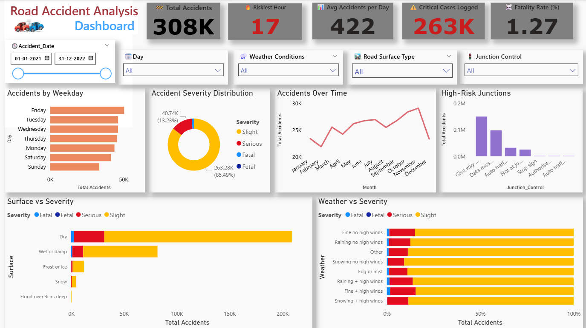

Road Accident Analysis Dashboard – Power BI

This repository contains an interactive Power BI dashboard that provides deep insights into road accident data from 2021 to 2022. The dashboard focuses on identifying high-risk patterns, severity distribution, accident causes, and environmental factors to assist in road safety decision-making.

Dashboard Features

KPI Cards (Top Panel)
- Total Accidents – Total number of accidents reported.
- Riskiest Hour – Peak hour of accident occurrence.
- Avg Accidents per Day – Daily average accidents.
- Critical Cases Logged – Serious accident count.
- Fatality Rate (%) – Ratio of fatal cases to total cases.

Visual Insights
1. Accidents by Weekday – Distribution of accidents over days of the week.
2. Accident Severity Distribution – Pie chart showing severity levels: Slight, Serious, Fatal.
3. Accidents Over Time – Monthly trend of accident occurrences.
4. High-Risk Junctions – Top junction controls contributing to accidents.
5. Surface vs Severity – Impact of road surface on accident severity.
6. Weather vs Severity – Comparison of accident severity under various weather conditions.

Interactive Slicers
- Date Range Selector
- Day of Week
- Weather Conditions
- Road Surface Type
- Junction Control

Tools & Technologies
- Power BI
- DAX (Data Analysis Expressions)
- Excel for Data Preprocessing

Dashboard Preview

Key Insights
- Most accidents occurred during evening peak hours.
- "Dry" surface conditions and "Fine, no wind" weather still showed high accident rates — indicating driver behavior as a factor.
- Fridays and Tuesdays reported the most accidents.
- “Give Way” and “Auto Traffic Signal” junctions were hotspots for incidents.

Goals
- To identify accident trends over time.
- To analyze environmental and infrastructural factors causing accidents.
- To aid in targeted interventions and urban road planning.

